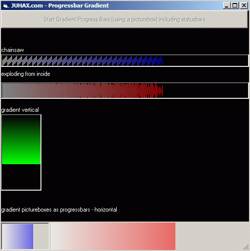



## Gradient pictureboxes as progressbars

### Description

Gradient picturebox as Progressbars vertical and horizontl + placement in statusbar
 
### More Info
 

             |
---                |---
**Submitted On**   |2010-04-16 14:40:02
**By**             |[Juha s�derqvist](https://github.com/Planet-Source-Code/PSCIndex/blob/master/ByAuthor/juha-s-derqvist.md)
**Level**          |Advanced
**User Rating**    |5.0 (15 globes from 3 users)
**Compatibility**  |VB 6\.0
**Category**       |[Graphics](https://github.com/Planet-Source-Code/PSCIndex/blob/master/ByCategory/graphics__1-46.md)
**World**          |[Visual Basic](https://github.com/Planet-Source-Code/PSCIndex/blob/master/ByWorld/visual-basic.md)
**Archive File**   |[Gradient\_p2179084162010\.zip](https://github.com/Planet-Source-Code/juha-s-derqvist-gradient-pictureboxes-as-progressbars__1-73072/archive/master.zip)

